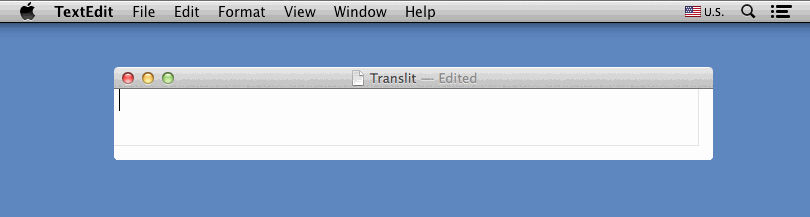

# Read me first

This for exists solely so I can point people to the binary that I've now added to the repo as the original author sent it to me a long time ago. The codebase is unmaintained and all my attempts to get in touch with the original author failed.

To install it, [download the binary](Cyrillic Transliterator Input Method.app.zip), unzip it and put it in `~/Library/Input Methods`. Go to System Preferences -> Keyboard -> Input Sources, click "+", then scroll down to Russian or simply search for "Cyrillic Transliterator". After that it simply works.

I've tested it under macOS Big Sur on a 13" M1 Macbook Pro and macOS Monterey RC2 on a 16" 2019 Macbook Pro and it worked without any issues.

I managed to compile the Input Method with Xcode 13, but as soon as I try to use it the system starts beachballing. I'm not a Mac developer though and since the old binary works, I won't be debugging this.

Original README below.

# Cyrillic Transliterator

This set of apps allows you to type Latin characters in OSX and have them transliterate in real time into Cyrillic characters. This includes multi-character transliterations like 'sh'/'ш'.

## Background

I'm Russian and I frequently have to type using the Cyrillic alphabet. Unfortunately, even after several years, I just can't get the hang of the native Russian keyboard layout. It's far too frustrating to peck out paragraphs one letter at a time when you can speed through English text at 100 words per minute!

A few years ago, a friend pointed me to the website [Translit.ru][1], and I discovered that I can suddenly type in Russian almost as fast as I can in English. The trick is that almost every character in the Cyrillic alphabet has a simple transliteration at most three characters long; for example, 'я' is 'ya', and 'ш' is 'sh'. All you have to do is type the transliterated Russian text into Translit and it spits out the Russian for you as you go.

Recently, I've been getting frustrated that I had to open my browser, go to some website, and then copy text whenever I wanted to type something in Russian. Why couldn't I do it natively from my OS? True, OSX had a built-in phonetic Russian keyboard, but it was flawed; since each key only mapped to a single transliterated key, it only worked as long as the Latin letter sounded like the Cyrillic one. Letters like 'я' ('ya') ended up mapped to completely irrelevant letters ('q').

So after a bit of research, I started working on a couple of solutions. The first one I finished was an input method, and it works almost exactly like the website — only natively, right inside my OS!

## Techniques

Transliteration can be done in one of five ways. (At the moment, three are functional.) My current preference is for the **input method** technique, along with the **Service** to deal with selected text. (For details, please see the relevant Wiki page.)

### Input Method

OSX has native [input method][2] support, typically for complicated character input like Chinese or Hebrew. The advantage of this method is that the transliterated keyboard shows up with all your other keyboards in your menu bar and behaves as expected with all text fields. To install, copy the input method app into your `~/Library/Input Methods` directory and select the "Cyrillic Transliterator" keyboard from the Russian section.

### Menu Bar App (WIP, but functional)

This app runs in the menu bar and transliterates text based on Quartz event taps. Behavior is not as predictable as with the input method approach, since the app has no way of knowing if the user is typing into a text box. Accesibility has to be turned on for this app. Since dealing with input methods can be a little messy, this app is intended for users who would feel more safe with a stand-alone app.

### Sandboxed Text Box App (WIP)

Intended for Mac App Store release, this app presents a simple text box that the user can type text into and then manually copy the transliteration from. The app can also transliterate pasted text.

### Keylayout File Converter (WIP)

I just discovered that you can have input-method-like transliteration support with simple Ukelele-generated keyfiles, like in this project [here][4] or [here][5]. They're hairy to make by hand, so this tool converts my .translit mapping files into .keylayout files.

### Service

In addition to the real-time transliteration support provided by the apps above, you can also transliterate selected text via Services. This can be bound to a key command in OSX settings.

---

The demo animation was created by using [LICEcap][3] to capture the OSX on-screen keyboard over a TextEdit window.

[1]: http://www.translit.ru
[2]: http://en.wikipedia.org/wiki/Input_method
[3]: http://www.cockos.com/licecap/
[4]: https://github.com/bernardn/macos-transliteration
[5]: http://github.com/aik099/custom.keylayout